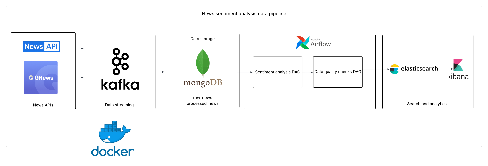

# News sentiment analysis data pipeline

This is a real-time data pipeline that fetches news articles from NewsAPI and GNews API, analyzes sentiment, and provides searchable analytics.

## Architecture Overview




The pipeline fetches articles every 5 minutes, streams them through Kafka, stores in MongoDB, processes sentiment hourly via Airflow, and indexes results in Elasticsearch for analysis.

## Features of the pipeline

- **Multi-source ingestion**: NewsAPI and GNews API integration
- **Real-time streaming**: Apache Kafka message processing
- **Sentiment analysis**: VADER + TextBlob dual algorithm approach
- **Search capabilities**: Elasticsearch full-text search
- **Visual dashboards**: Kibana 
- **Automated workflows**: Airflow batch processing  

## Quick Start

### Prerequisites
- Docker and Docker Compose
- Python 3.9+
- API keys: [NewsAPI](https://newsapi.org/) and [GNews](https://gnews.io/)

### Setup

1. **Clone and configure**
```bash
git clone https://github.com/marouanebatrone/sentiment-analysis-data-pipeline
cd news-sentiment-data-pipeline
cp .env.example .env
# Add your API keys to .env
```

2. **Start infrastructure**
```bash
chmod +x docker_startup.sh
./docker_startup.sh
```

3. **Install dependencies**
```bash
pip install -r requirements.txt
```

4. **Start pipeline**
```bash
# Terminal 1 - Consumer
python scripts/start_consumer.py

# Terminal 2 - Producers
python scripts/start_producers.py
```

5. **Enable Airflow DAGs**
- Go to http://localhost:8081 (admin/admin)
- Enable both DAGs: `news_sentiment_analysis` and `data_quality_monitoring`

## Service Access

- Airflow: http://localhost:8081  
- Kibana: http://localhost:5601
- Kafka UI: http://localhost:8080
- Elasticsearch: http://localhost:9200

## Data Flow

### Real-time Ingestion
1. **Producers** fetch articles from NewsAPI and GNews every 5 minutes
2. **Kafka** streams articles to `news-raw` topic
3. **Consumer** processes messages and stores in MongoDB `raw_news` collection

### Batch Processing
1. **Airflow DAG** runs hourly to process new articles
2. **Sentiment Analysis** applies VADER + TextBlob algorithms
3. **Results** stored in MongoDB `processed_news` and indexed in Elasticsearch
